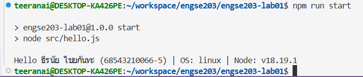

# 💻 ENGSE203 LAB 01 — Developer Environment & Git/GitHub

## 👤 ผู้จัดทำ
* **ชื่อ-นามสกุล:** <นายธีรนัย ไชยกันทะ>
* **รหัสนักศึกษา:** `68543210066-5`
* **ระบบปฏิบัติการที่ใช้:** 🐧 Linux (WSL 2 - Ubuntu 24.04) on Windows

---

## 🎯 วัตถุประสงค์ของงาน
* ตรวจสอบและใช้ Node.js, npm, Visual Studio Code และ Git จาก Terminal ได้
* สร้างโครงงาน JavaScript ขนาดย่อม พร้อม package.json และ npm script
* รันโปรแกรม Node.js ที่แสดงชื่อ รหัสนักศึกษา OS และ Node.js version ได้
* สร้าง GitHub repository, commit, push และจัดทำ README เพื่อเป็นหลักฐานการเรียนรู้ได้

---

## 🛠️ เครื่องมือที่ใช้
* **Code Editor:** Visual Studio Code
* **Runtime:** Node.js v18.19.1 และ npm
* **Version Control:** Git & WSL (Ubuntu-24.04)
* **Git:** บัญชี GitHub ที่ใช้งานได้
* **Internet**

---

## 🚀 วิธีติดตั้งและรัน
เปิด Terminal ในโฟลเดอร์โปรเจกต์แล้วรันคำสั่งต่อไปนี้:

```bash
# รันโปรแกรม NodeJS เพื่อแสดงผลลัพธ์
npm install
npm run start
```

---

## 📂 โครงสร้างไฟล์
```text
engse203-lab01/
├── src/
│   └── hello.js
├── package.json
└── README.md
```

---

## 📊 หลักฐานผลลัพธ์
เมื่อรันคำสั่ง `npm run start` ระบบจะแสดงชื่อ-นามสกุล รหัสนักศึกษา และเวอร์ชันของระบบปฏิบัติการอย่างถูกต้องใน Terminal ดังนี้:

> 💡 **คำแนะนำสำหรับคุณ:** ให้พิมพ์คำสั่ง `npm run start` ใน VS Code อีกครั้ง แล้วแคปภาพผลลัพธ์ที่ขึ้นคำว่า "Hello ..." มาวางแทนที่ลิงก์ภาพด้านล่างนี้ หรือพิมพ์ข้อความผลลัพธ์ใส่แทนได้เลยครับ



---

## ❌ ปัญหาที่พบและวิธีแก้ไข

### 1. ปัญหา: พิมพ์คำสั่งต่อกันและสะกดอีเมลผิด
* **รายละเอียด:** เผลอก๊อปปี้คำสั่งทั้งหมดมาวางพร้อมกันใน Terminal ทำให้อ่านคำสั่งผิดพลาด และพิมพ์อีเมลสลับเป็น `gamil.com` ทำให้อัปโหลดไม่ผ่าน
* **วิธีแก้:** ทำการล้างค่า `remote origin` เก่าออก แก้ไขอีเมลให้ถูกต้องเป็น `gmail.com` และค่อย ๆ รันคำสั่งทีละบรรทัด

### 2. ปัญหา: Permission denied (publickey)
* **รายละเอียด:** ระบบ WSL Ubuntu ยังไม่ได้รับสิทธิ์ในการผลักโค้ด (Push) ขึ้นไปบนระบบ GitHub
* **วิธีแก้:** เจนรหัสรหัสความปลอดภัยขึ้นมาใหม่ด้วยคำสั่ง `ssh-keygen` จากนั้นคัดลอกรหัส Public Key จากไฟล์ `id_ed25519.pub` ไปลงทะเบียนเพิ่มในหน้าบัญชี GitHub Settings ของตนเอง

---

## 🤖 References & AI Assistance
* **Source / Documentation:** คู่มือปฏิบัติการวิชา ENGSE203 สัปดาห์ที่ 1
* **AI tool used:** Gemini
* **Used for:** ช่วยแปลข้อความ Error และแนะนำขั้นตอนการแก้ไขปัญหาการเชื่อมต่อ SSH Key ระหว่าง WSL กับ GitHub ทีละสเต็ป
* **My adaptation:** นำคำสั่งที่ AI แนะนำมาประยุกต์พิมพ์ทีละบรรทัด ตรวจสอบความถูกต้องจนสามารถ Push โค้ดส่งขึ้นคลาวด์ได้สำเร็จ
